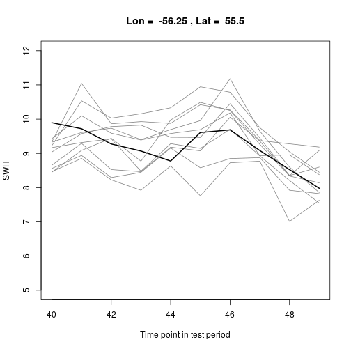

## Example of a prediction model for significant wave height (SWH) based on sea level pressure (SLP)
### Authors: Hugo L. Hammer, Tor Arne Oigaard, Thordis Thorarinsdottir and Hanne Rognebakke

Scripts are located in the folder script.
Data example is located in the folder data. 

R working directory should be set to the location of the script folder.

To run the analysis, run the script run_models.r as shown below. 

Load necessary packages and source functions.

```r
require(glmnet)
require(forecast)
source("getPreddistr.r")
source("BoxCoxLambda.r")
source("BoxCoxLambdaKnown.r")
source("fourier.r")
source("qBoxCox.r")
source("pBoxCox.r")
```

Load ERA-Interim data 

```r
load("../data/SWH_SLP_SLP.grad.subset.7.Rdata")
longitudeSWH
```

```
## [1] -58.50 -57.75 -57.00 -56.25 -55.50 -54.75 -54.00
```

```r
latitudeSWH
```

```
## [1] 57.75 57.00 56.25 55.50 54.75 54.00 53.25
```

```r
range(years.all)
```

```
## [1] 2006 2015
```

```r
summary(SWH)
```

```
##    Min. 1st Qu.  Median    Mean 3rd Qu.    Max. 
##  0.4726  2.1296  3.0538  3.4142  4.3071 16.5310
```

```r
summary(SLP)
```

```
##    Min. 1st Qu.  Median    Mean 3rd Qu.    Max. 
##   93301  100127  101100  100975  101975  104539
```

```r
summary(SLP.grad)
```

```
##     Min.  1st Qu.   Median     Mean  3rd Qu.     Max. 
## 0.000000 0.004531 0.011082 0.017110 0.022871 0.538579
```

Set which grid cell to model (out of a total of 7x7 cells).

```r
lonSWH = 4
latSWH = 4
```

Define how many missing values is "good enough", and define the model to use.

```r
na.thresh = 500
spatial.neighborhoods = 2 
models.fourier = c("Proposed model, AR order = 5, spatial neigb. = ", spatial.neighborhoods, "\n")
n.models.fourier = length(models.fourier)
```

Create Fourier terms to use in the modeling

```r
m.fourier = 365.25*4 # Number of observations per year. Four observations per day.
K.fourier = 2 # Number of Fourier terms
n.time = length(time.all)
intercept.fourier = fourier(rep(1,n.time), K=K.fourier, m=m.fourier)
colnames(intercept.fourier) = paste("intercept", colnames(intercept.fourier), sep = "_")
```

Split that data in a training set and a test set 

```r
training.test = list()
training.test[[1]] = which(years.all %in% 2006:2014)
training.test[[2]] = which(years.all %in% 2015)
```

Estimate model parameters and obtain predictive distributions

```r
pred.dist  <- getPreddistr(j=lonSWH, k=latSWH, neig=spatial.neighborhoods)
```

```
## Fourier: j = 4 , k = 4
```

```
## Error in skewness(obs.trans[i, ], na.rm = TRUE): konnte Funktion "skewness" nicht finden
```

```r
pred.mean = pred.dist$pred.mean
```

```
## Error in eval(expr, envir, enclos): Objekt 'pred.dist' nicht gefunden
```

```r
pred.sd = pred.dist$pred.sd
```

```
## Error in eval(expr, envir, enclos): Objekt 'pred.dist' nicht gefunden
```

```r
pred.lambda = pred.dist$pred.lambda
```

```
## Error in eval(expr, envir, enclos): Objekt 'pred.dist' nicht gefunden
```

```r
print(pred.dist$fits)
```

```
## Error in print(pred.dist$fits): Objekt 'pred.dist' nicht gefunden
```

Create the vector of observations in the test period

```r
obs  <- SWH[lonSWH, latSWH, training.test[[2]]]
```

Calculate PIT values and plot a PIT histogram for the test set 

```r
pit  <- pBoxCox(obs, pred.mean, pred.sd, pred.lambda)
```

```
## Error in BoxCoxLambdaKnown(x, lambda): Objekt 'pred.lambda' nicht gefunden
```

```r
hist(pit, freq=FALSE, nclass=10, col="gray", xlab="PIT value", 
     main=paste("Lon = ", longitudeSWH[lonSWH], ", Lat = ", latitudeSWH[latSWH]))
```

```
## Error in hist(pit, freq = FALSE, nclass = 10, col = "gray", xlab = "PIT value", : Objekt 'pit' nicht gefunden
```

```r
abline(a=1, b=0, lty=2)
```

```
## Error in int_abline(a = a, b = b, h = h, v = v, untf = untf, ...): plot.new has not been called yet
```

Calculate the mean absolute error over the test period

```r
pred.median  <- qBoxCox(0.5, pred.mean, pred.sd, pred.lambda)
```

```
## Error in qBoxCox(0.5, pred.mean, pred.sd, pred.lambda): Objekt 'pred.lambda' nicht gefunden
```

```r
mae  <- mean(abs(obs - pred.median))
```

```
## Error in mean(abs(obs - pred.median)): Objekt 'pred.median' nicht gefunden
```

```r
mae
```

```
## Error in eval(expr, envir, enclos): Objekt 'mae' nicht gefunden
```
Plot the prediction and the observation in the first and last 100 time points of the test period

```r
upper  <- qBoxCox(0.95, pred.mean, pred.sd, pred.lambda)
```

```
## Error in qBoxCox(0.95, pred.mean, pred.sd, pred.lambda): Objekt 'pred.lambda' nicht gefunden
```

```r
lower  <- qBoxCox(0.05, pred.mean, pred.sd, pred.lambda)
```

```
## Error in qBoxCox(0.05, pred.mean, pred.sd, pred.lambda): Objekt 'pred.lambda' nicht gefunden
```

```r
t.period  <- c(1:100)
t.upper  <- upper[t.period]
```

```
## Error in eval(expr, envir, enclos): Objekt 'upper' nicht gefunden
```

```r
t.lower  <- lower[t.period]
```

```
## Error in eval(expr, envir, enclos): Objekt 'lower' nicht gefunden
```

```r
plot(t.period, obs[t.period], type="l",
     xlab="Time point in test period", ylab="SWH", ylim=c(0,15),
     main=paste("Lon = ", longitudeSWH[lonSWH], ", Lat = ", latitudeSWH[latSWH]))
polygon(c(t.period, rev(t.period), t.period[1]),
        c(t.lower, rev(t.upper), t.lower[1]), col="gray90", border="NA")
```

```
## Error in xy.coords(x, y, setLab = FALSE): Objekt 't.lower' nicht gefunden
```

```r
lines(t.period, obs[t.period])
lines(t.period, pred.median[t.period], col="gray50", lty=2)
```

```
## Error in xy.coords(x, y): Objekt 'pred.median' nicht gefunden
```

```r
legend("topright", lty=c(1,2,1), lwd=c(1,1,4), col=c("black", "gray50", "gray90"),
       legend=c("Observation", "Predictive median", "90% prediction interval"))
```


```r
t.period  <- c(1361:1460)
t.upper  <- upper[t.period]
```

```
## Error in eval(expr, envir, enclos): Objekt 'upper' nicht gefunden
```

```r
t.lower  <- lower[t.period]
```

```
## Error in eval(expr, envir, enclos): Objekt 'lower' nicht gefunden
```

```r
plot(t.period, obs[t.period], type="l",
     xlab="Time point in test period", ylab="SWH", ylim=c(0,15),
     main=paste("Lon = ", longitudeSWH[lonSWH], ", Lat = ", latitudeSWH[latSWH]))
polygon(c(t.period, rev(t.period), t.period[1]),
        c(t.lower, rev(t.upper), t.lower[1]), col="gray90", border="NA")
```

```
## Error in xy.coords(x, y, setLab = FALSE): Objekt 't.lower' nicht gefunden
```

```r
lines(t.period, obs[t.period])
lines(t.period, pred.median[t.period], col="gray50", lty=2)
```

```
## Error in xy.coords(x, y): Objekt 'pred.median' nicht gefunden
```

```r
legend("topright", lty=c(1,2,1), lwd=c(1,1,4), col=c("black", "gray50", "gray90"),
       legend=c("Observation", "Predictive median", "90% prediction interval"))
```


Random predictive trajectories for 10 time points

```r
t.ind  <- c(40:49)
random.q  <- array(NA, dim=c(10,10))
for(i in 1:10) random.q[,i]  <- qBoxCox(runif(10), pred.mean[t.ind[i]], pred.sd, pred.lambda)
```

```
## Error in qBoxCox(runif(10), pred.mean[t.ind[i]], pred.sd, pred.lambda): Objekt 'pred.lambda' nicht gefunden
```

```r
random.q
```

```
##       [,1] [,2] [,3] [,4] [,5] [,6] [,7] [,8] [,9] [,10]
##  [1,]   NA   NA   NA   NA   NA   NA   NA   NA   NA    NA
##  [2,]   NA   NA   NA   NA   NA   NA   NA   NA   NA    NA
##  [3,]   NA   NA   NA   NA   NA   NA   NA   NA   NA    NA
##  [4,]   NA   NA   NA   NA   NA   NA   NA   NA   NA    NA
##  [5,]   NA   NA   NA   NA   NA   NA   NA   NA   NA    NA
##  [6,]   NA   NA   NA   NA   NA   NA   NA   NA   NA    NA
##  [7,]   NA   NA   NA   NA   NA   NA   NA   NA   NA    NA
##  [8,]   NA   NA   NA   NA   NA   NA   NA   NA   NA    NA
##  [9,]   NA   NA   NA   NA   NA   NA   NA   NA   NA    NA
## [10,]   NA   NA   NA   NA   NA   NA   NA   NA   NA    NA
```

```r
plot(t.ind, random.q[1,], type="l", col="gray50",
     xlab="Time point in test period", ylab="SWH", ylim=c(5,12),
     main=paste("Lon = ", longitudeSWH[lonSWH], ", Lat = ", latitudeSWH[latSWH]))
for(i in 2:10) lines(t.ind, random.q[i,], col="gray50")
lines(t.ind, obs[t.ind], col="black", lwd=2)
```


Learn correlation from previous timepoints (last 100 time points in test period)

```r
sample.q  <- array(NA, dim=c(10,10))
for(i in 1:10) sample.q[,i]  <- rank(random.q[,i])
sample.q
```

```
##       [,1] [,2] [,3] [,4] [,5] [,6] [,7] [,8] [,9] [,10]
##  [1,]    1    1    1    1    1    1    1    1    1     1
##  [2,]    2    2    2    2    2    2    2    2    2     2
##  [3,]    3    3    3    3    3    3    3    3    3     3
##  [4,]    4    4    4    4    4    4    4    4    4     4
##  [5,]    5    5    5    5    5    5    5    5    5     5
##  [6,]    6    6    6    6    6    6    6    6    6     6
##  [7,]    7    7    7    7    7    7    7    7    7     7
##  [8,]    8    8    8    8    8    8    8    8    8     8
##  [9,]    9    9    9    9    9    9    9    9    9     9
## [10,]   10   10   10   10   10   10   10   10   10    10
```

```r
T  <- length(training.test[[2]])
h.ind  <- training.test[[2]][(T-99):T]
hist.obs  <- t(array(SWH[lonSWH, latSWH, h.ind], dim=c(10,10)))
hist.q  <- array(NA, dim=c(10,10))
for(i in 1:10) hist.q[,i]  <- rank(hist.obs[,i])
hist.q
```

```
##       [,1] [,2] [,3] [,4] [,5] [,6] [,7] [,8] [,9] [,10]
##  [1,]    5    6    8    8    5    5    8    8    6     8
##  [2,]    8    7    7    7    7    7   10    9    7     4
##  [3,]    2    1    1    1    1    1    1    1    1     2
##  [4,]    3    2    2    2    2    2    2    2    2     3
##  [5,]    4    4    3    3    3    3    4    6    5     9
##  [6,]   10    8    6    6    6    6    5    4    8     6
##  [7,]    7    9   10   10   10   10    9   10    9     7
##  [8,]    6    5    4    4    4    4    3    3    3     1
##  [9,]    1    3    5    5    9    9    6    5    4     5
## [10,]    9   10    9    9    8    8    7    7   10    10
```

```r
sort.q  <- random.q
for(i in 1:10) sort.q[,i]  <- sort(random.q[,i])[hist.q[,i]]
plot(t.ind, sort.q[1,], type="l", col="gray50",
     xlab="Time point in test period", ylab="SWH", ylim=c(5,12),
     main=paste("Lon = ", longitudeSWH[lonSWH], ", Lat = ", latitudeSWH[latSWH]))
for(i in 2:10) lines(t.ind, sort.q[i,], col="gray50")
lines(t.ind, obs[t.ind], col="black", lwd=2)
```


