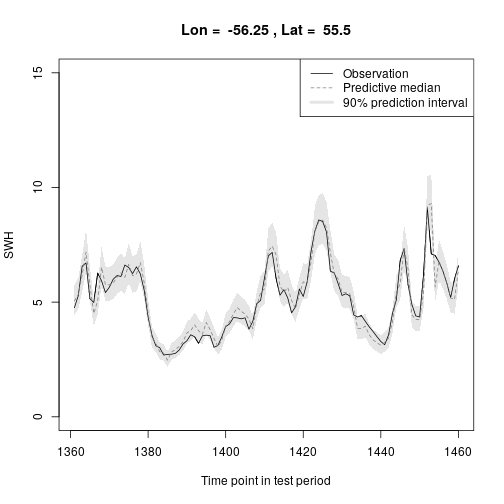

## Example of a prediction model for significant wave height (SWH) based on sea level pressure (SLP)
### Authors: Hugo L. Hammer, Tor Arne Oigaard, Thordis Thorarinsdottir and Hanne Rognebakke

Scripts are located in the folder script.
Data example is located in the folder data. 

R working directory should be set to the location of the script folder.

To run the analysis, run the script run_models.r as shown below. 

Load necessary packages and source functions.

```r
require(glmnet)
require(forecast)
require(moments)
source("getPreddistr.r")
source("BoxCoxLambda.r")
source("BoxCoxLambdaKnown.r")
source("fourier.r")
source("qBoxCox.r")
source("pBoxCox.r")
```

Load ERA-Interim data 

```r
load("../data/SWH_SLP_SLP.grad.subset.7.Rdata")
longitudeSWH
```

```
## [1] -58.50 -57.75 -57.00 -56.25 -55.50 -54.75 -54.00
```

```r
latitudeSWH
```

```
## [1] 57.75 57.00 56.25 55.50 54.75 54.00 53.25
```

```r
range(years.all)
```

```
## [1] 2006 2015
```

```r
summary(SWH)
```

```
##    Min. 1st Qu.  Median    Mean 3rd Qu.    Max. 
##  0.4726  2.1296  3.0538  3.4142  4.3071 16.5310
```

```r
summary(SLP)
```

```
##    Min. 1st Qu.  Median    Mean 3rd Qu.    Max. 
##   93301  100127  101100  100975  101975  104539
```

```r
summary(SLP.grad)
```

```
##     Min.  1st Qu.   Median     Mean  3rd Qu.     Max. 
## 0.000000 0.004531 0.011082 0.017110 0.022871 0.538579
```

Set which grid cell to model (out of a total of 7x7 cells).

```r
lonSWH = 4
latSWH = 4
```

Define how many missing values is "good enough", and define the model to use.

```r
na.thresh = 500
spatial.neighborhoods = 2 
models.fourier = c("Proposed model, AR order = 5, spatial neigb. = ", spatial.neighborhoods, "\n")
n.models.fourier = length(models.fourier)
```

Create Fourier terms to use in the modeling

```r
m.fourier = 365.25*4 # Number of observations per year. Four observations per day.
K.fourier = 2 # Number of Fourier terms
n.time = length(time.all)
intercept.fourier = fourier(rep(1,n.time), K=K.fourier, m=m.fourier)
colnames(intercept.fourier) = paste("intercept", colnames(intercept.fourier), sep = "_")
```

Split that data in a training set and a test set 

```r
training.test = list()
training.test[[1]] = which(years.all %in% 2006:2014)
training.test[[2]] = which(years.all %in% 2015)
```

Estimate model parameters and obtain predictive distributions

```r
pred.dist  <- getPreddistr(j=lonSWH, k=latSWH, neig=spatial.neighborhoods)
```

```
## Fourier: j = 4 , k = 4 
## Total number of potential predictors: 69 
## Number of predictors selected by LASSO: 52
```

```r
pred.mean = pred.dist$pred.mean
pred.sd = pred.dist$pred.sd
pred.lambda = pred.dist$pred.lambda
print(pred.dist$fits)
```

```
## 
## Call:
## lm(formula = SWH.bc.standard.training ~ ., data = predictors.training)
## 
## Residuals:
##      Min       1Q   Median       3Q      Max 
## -0.76520 -0.10036 -0.00888  0.09102  1.03424 
## 
## Coefficients:
##               Estimate Std. Error t value Pr(>|t|)    
## (Intercept)  8.826e-03  1.912e-03   4.615 3.97e-06 ***
## V1           3.879e-01  2.789e-02  13.908  < 2e-16 ***
## V2          -3.093e-01  2.319e-02 -13.340  < 2e-16 ***
## V4          -2.570e-02  8.679e-03  -2.961 0.003073 ** 
## V5          -1.649e-02  4.442e-03  -3.712 0.000206 ***
## V6           1.227e-01  1.683e-02   7.291 3.26e-13 ***
## V7          -7.061e-06  2.143e-02   0.000 0.999737    
## V8          -1.418e-02  3.901e-02  -0.364 0.716153    
## V9          -6.143e-04  2.416e-03  -0.254 0.799308    
## V10         -5.574e-03  2.476e-03  -2.251 0.024423 *  
## V11         -8.604e-03  2.406e-02  -0.358 0.720678    
## V12          8.637e-02  3.192e-02   2.706 0.006828 ** 
## V20         -3.691e-02  1.218e-02  -3.031 0.002443 ** 
## V22          1.210e-02  1.165e-02   1.039 0.298862    
## V23         -3.883e-03  4.536e-03  -0.856 0.392043    
## V24          3.937e-04  6.237e-03   0.063 0.949668    
## V25          7.161e-03  4.507e-03   1.589 0.112058    
## V26          8.851e-03  6.078e-03   1.456 0.145343    
## V27         -4.226e-03  6.881e-03  -0.614 0.539134    
## V28          5.444e-02  2.339e-02   2.327 0.019956 *  
## V29         -1.269e-02  9.536e-03  -1.331 0.183214    
## V30         -3.398e-02  2.142e-02  -1.587 0.112650    
## V31          1.456e-02  2.289e-03   6.362 2.06e-10 ***
## V32          7.912e-02  2.908e-03  27.213  < 2e-16 ***
## V33         -1.493e-03  2.373e-03  -0.629 0.529159    
## V34         -7.631e-03  2.378e-03  -3.209 0.001336 ** 
## V35         -1.345e-01  3.831e-02  -3.511 0.000447 ***
## V36         -1.921e-02  7.439e-03  -2.582 0.009820 ** 
## V38         -7.006e-02  5.345e-02  -1.311 0.189992    
## V42         -2.294e-02  1.023e-02  -2.242 0.024995 *  
## V43         -1.362e-03  9.077e-03  -0.150 0.880712    
## V44          1.945e-02  1.032e-02   1.884 0.059577 .  
## V45          1.222e+00  8.132e-03 150.238  < 2e-16 ***
## V46          7.960e-03  6.465e-03   1.231 0.218264    
## V47         -1.204e-03  1.149e-02  -0.105 0.916519    
## V48          2.209e-02  9.986e-03   2.212 0.026970 *  
## V49         -1.522e-02  1.137e-02  -1.339 0.180465    
## V50         -4.746e-01  1.339e-02 -35.453  < 2e-16 ***
## V52         -2.856e-02  1.887e-02  -1.514 0.130104    
## V53         -2.621e-02  1.061e-02  -2.470 0.013525 *  
## V54          1.403e-02  1.843e-02   0.761 0.446469    
## V55          1.016e-01  1.397e-02   7.274 3.69e-13 ***
## V56         -2.348e-02  1.371e-02  -1.712 0.086869 .  
## V57          9.316e-03  1.968e-02   0.473 0.635938    
## V59         -1.008e-03  1.365e-02  -0.074 0.941149    
## V60         -4.699e-02  1.303e-02  -3.606 0.000312 ***
## V61          2.440e-02  1.783e-02   1.368 0.171242    
## V62          1.710e-02  1.835e-02   0.932 0.351247    
## V65          2.277e-02  7.117e-03   3.199 0.001382 ** 
## V66         -4.193e-03  1.007e-02  -0.416 0.677244    
## V67         -9.406e-03  1.002e-02  -0.939 0.347790    
## V68          8.730e-03  3.923e-03   2.225 0.026091 *  
## V69         -2.900e-03  5.471e-03  -0.530 0.596090    
## ---
## Signif. codes:  0 '***' 0.001 '**' 0.01 '*' 0.05 '.' 0.1 ' ' 1
## 
## Residual standard error: 0.1601 on 13095 degrees of freedom
## Multiple R-squared:  0.9745,	Adjusted R-squared:  0.9744 
## F-statistic:  9615 on 52 and 13095 DF,  p-value: < 2.2e-16
```

Create the vector of observations in the test period

```r
obs  <- SWH[lonSWH, latSWH, training.test[[2]]]
```

Calculate PIT values and plot a PIT histogram for the test set 

```r
pit  <- pBoxCox(obs, pred.mean, pred.sd, pred.lambda)
hist(pit, freq=FALSE, nclass=10, col="gray", xlab="PIT value", 
     main=paste("Lon = ", longitudeSWH[lonSWH], ", Lat = ", latitudeSWH[latSWH]))
abline(a=1, b=0, lty=2)
```


Calculate the mean absolute error over the test period

```r
pred.median  <- qBoxCox(0.5, pred.mean, pred.sd, pred.lambda)
mae  <- mean(abs(obs - pred.median))
mae
```

```
## [1] 0.2328819
```
Plot the prediction and the observation in the first and last 100 time points of the test period

```r
upper  <- qBoxCox(0.95, pred.mean, pred.sd, pred.lambda)
lower  <- qBoxCox(0.05, pred.mean, pred.sd, pred.lambda)

t.period  <- c(1:100)
t.upper  <- upper[t.period]
t.lower  <- lower[t.period]

plot(t.period, obs[t.period], type="l",
     xlab="Time point in test period", ylab="SWH", ylim=c(0,15),
     main=paste("Lon = ", longitudeSWH[lonSWH], ", Lat = ", latitudeSWH[latSWH]))
polygon(c(t.period, rev(t.period), t.period[1]),
        c(t.lower, rev(t.upper), t.lower[1]), col="gray90", border="NA")
lines(t.period, obs[t.period])
lines(t.period, pred.median[t.period], col="gray50", lty=2)
legend("topright", lty=c(1,2,1), lwd=c(1,1,4), col=c("black", "gray50", "gray90"),
       legend=c("Observation", "Predictive median", "90% prediction interval"))
```


```r
t.period  <- c(1361:1460)
t.upper  <- upper[t.period]
t.lower  <- lower[t.period]

plot(t.period, obs[t.period], type="l",
     xlab="Time point in test period", ylab="SWH", ylim=c(0,15),
     main=paste("Lon = ", longitudeSWH[lonSWH], ", Lat = ", latitudeSWH[latSWH]))
polygon(c(t.period, rev(t.period), t.period[1]),
        c(t.lower, rev(t.upper), t.lower[1]), col="gray90", border="NA")
lines(t.period, obs[t.period])
lines(t.period, pred.median[t.period], col="gray50", lty=2)
legend("topright", lty=c(1,2,1), lwd=c(1,1,4), col=c("black", "gray50", "gray90"),
       legend=c("Observation", "Predictive median", "90% prediction interval"))
```



Random predictive trajectories for 10 time points

```r
t.ind  <- c(40:49)
random.q  <- array(NA, dim=c(10,10))
for(i in 1:10) random.q[,i]  <- qBoxCox(runif(10), pred.mean[t.ind[i]], pred.sd, pred.lambda)
random.q
```

```
##           [,1]      [,2]      [,3]      [,4]      [,5]      [,6]      [,7]
##  [1,] 9.429771  9.610763  8.525877 10.158165 10.332912 10.492195 11.182405
##  [2,] 8.653724  9.316949  9.590308  8.772157  9.875716  9.957759  8.726901
##  [3,] 9.333055  9.577181 10.031716  9.825269  9.581286  9.467095 10.182503
##  [4,] 9.328564 11.045167  9.441738  8.446240  9.158470  7.760592 10.253491
##  [5,] 9.168353  9.088379  9.428345  9.928440  8.635019 10.421799  8.849250
##  [6,] 8.466053 10.536718  9.782850  8.466323  9.471122  9.146203  9.705457
##  [7,] 8.558771  9.293452  8.226525  8.478779  9.976094 10.945288 10.270651
##  [8,] 8.449548  8.853060  8.294006  9.390250  9.696294  8.579420 10.054352
##  [9,] 9.224228 10.098123  9.865008  9.401214  9.284202  9.074849 10.452984
## [10,] 9.039912  8.940767  9.736257  7.923322  9.181679  9.693540 10.787106
##           [,8]     [,9]    [,10]
##  [1,] 8.931922 8.208266 7.856963
##  [2,] 9.374602 8.957247 8.600213
##  [3,] 9.751878 8.597738 7.824361
##  [4,] 8.772154 7.012031 9.086296
##  [5,] 9.264266 8.349947 9.183543
##  [6,] 9.360806 8.352399 7.549240
##  [7,] 8.925110 8.339122 7.631270
##  [8,] 9.452692 7.923413 8.449031
##  [9,] 8.875158 9.278930 8.140958
## [10,] 9.651270 9.047410 8.379112
```

```r
plot(t.ind, random.q[1,], type="l", col="gray50",
     xlab="Time point in test period", ylab="SWH", ylim=c(5,12),
     main=paste("Lon = ", longitudeSWH[lonSWH], ", Lat = ", latitudeSWH[latSWH]))
for(i in 2:10) lines(t.ind, random.q[i,], col="gray50")
lines(t.ind, obs[t.ind], col="black", lwd=2)
```


Learn correlation from previous timepoints (last 100 time points in test period)

```r
sample.q  <- array(NA, dim=c(10,10))
for(i in 1:10) sample.q[,i]  <- rank(random.q[,i])
sample.q
```

```
##       [,1] [,2] [,3] [,4] [,5] [,6] [,7] [,8] [,9] [,10]
##  [1,]   10    7    3   10   10    9   10    4    3     4
##  [2,]    4    5    6    5    8    7    1    7    8     8
##  [3,]    9    6   10    8    6    5    5   10    7     3
##  [4,]    8   10    5    2    2    1    6    1    1     9
##  [5,]    6    3    4    9    1    8    2    5    5    10
##  [6,]    2    9    8    3    5    4    3    6    6     1
##  [7,]    3    4    1    4    9   10    7    3    4     2
##  [8,]    1    1    2    6    7    2    4    8    2     7
##  [9,]    7    8    9    7    4    3    8    2   10     5
## [10,]    5    2    7    1    3    6    9    9    9     6
```

```r
T  <- length(training.test[[2]])
h.ind  <- training.test[[2]][(T-99):T]
hist.obs  <- t(array(SWH[lonSWH, latSWH, h.ind], dim=c(10,10)))
hist.q  <- array(NA, dim=c(10,10))
for(i in 1:10) hist.q[,i]  <- rank(hist.obs[,i])
hist.q
```

```
##       [,1] [,2] [,3] [,4] [,5] [,6] [,7] [,8] [,9] [,10]
##  [1,]    5    6    8    8    5    5    8    8    6     8
##  [2,]    8    7    7    7    7    7   10    9    7     4
##  [3,]    2    1    1    1    1    1    1    1    1     2
##  [4,]    3    2    2    2    2    2    2    2    2     3
##  [5,]    4    4    3    3    3    3    4    6    5     9
##  [6,]   10    8    6    6    6    6    5    4    8     6
##  [7,]    7    9   10   10   10   10    9   10    9     7
##  [8,]    6    5    4    4    4    4    3    3    3     1
##  [9,]    1    3    5    5    9    9    6    5    4     5
## [10,]    9   10    9    9    8    8    7    7   10    10
```

```r
sort.q  <- random.q
for(i in 1:10) sort.q[,i]  <- sort(random.q[,i])[hist.q[,i]]
plot(t.ind, sort.q[1,], type="l", col="gray50",
     xlab="Time point in test period", ylab="SWH", ylim=c(5,12),
     main=paste("Lon = ", longitudeSWH[lonSWH], ", Lat = ", latitudeSWH[latSWH]))
for(i in 2:10) lines(t.ind, sort.q[i,], col="gray50")
lines(t.ind, obs[t.ind], col="black", lwd=2)
```


